# Domain Map Prompt

## Modules

### Analyse
- **Agrégats:**
    - `CodeSource` (Racine)
        - Entités: `FichierSource`, `MetriqueQualite`
        - VOs: `PathFichier`, `VersionControle`
- **Agrégats:**
    - `RapportAnalyse` (Racine)
        - Entités: `ResultatMetrique`, `SuggestionAmelioration`
        - VOs: `DateAnalyse`, `SeveriteSuggestion`

### Generation
- **Agrégats:**
    - `ConfigurationGeneration` (Racine)
        - Entités: `ModeleLangage`, `ParametreGeneration`
        - VOs: `NomModele`, `TemperatureSetting`
- **Agrégats:**
    - `ArtefactGenere` (Racine)
        - Entités: `BlocCode`, `DocumentationGeneree`
        - VOs: `LangageCible`, `StyleDocumentation`

### Orchestration
- **Agrégats:**
    - `PipelineTraitement` (Racine)
        - Entités: `EtapePipeline`, `DependanceEtape`
        - VOs: `OrdreExecution`, `StatutEtape`
- **Agrégats:**
    - `TacheExecution` (Racine)
        - Entités: `JournalEvenement`, `RessourceAllouee`
        - VOs: `IdentifiantTache`, `PrioriteTache`

### InteractionUtilisateur
- **Agrégats:**
    - `SessionUtilisateur` (Racine)
        - Entités: `RequeteUtilisateur`, `PreferenceUtilisateur`
        - VOs: `IdentifiantSession`, `LangueInterface`
- **Agrégats:**
    - `Notification` (Racine)
        - Entités: `CanalNotification`, `ModeleNotification`
        - VOs: `TypeNotification`, `Destinataire`

## Diagramme Mermaid - Domain Chart

```mermaid
graph TD
    subgraph Analyse
        A_CodeSource["`CodeSource (Agrégat)`"]
        A_FichierSource["`FichierSource (Entité)`"]
        A_MetriqueQualite["`MetriqueQualite (Entité)`"]
        A_PathFichier["`PathFichier (VO)`"]
        A_VersionControle["`VersionControle (VO)`"]
        A_RapportAnalyse["`RapportAnalyse (Agrégat)`"]
        A_ResultatMetrique["`ResultatMetrique (Entité)`"]
        A_SuggestionAmelioration["`SuggestionAmelioration (Entité)`"]
        A_DateAnalyse["`DateAnalyse (VO)`"]
        A_SeveriteSuggestion["`SeveriteSuggestion (VO)`"]

        A_CodeSource --> A_FichierSource
        A_CodeSource --> A_MetriqueQualite
        A_FichierSource --> A_PathFichier
        A_CodeSource --> A_VersionControle
        A_RapportAnalyse --> A_ResultatMetrique
        A_RapportAnalyse --> A_SuggestionAmelioration
        A_RapportAnalyse --> A_DateAnalyse
        A_SuggestionAmelioration --> A_SeveriteSuggestion
    end

    subgraph Generation
        G_ConfigurationGeneration["`ConfigurationGeneration (Agrégat)`"]
        G_ModeleLangage["`ModeleLangage (Entité)`"]
        G_ParametreGeneration["`ParametreGeneration (Entité)`"]
        G_NomModele["`NomModele (VO)`"]
        G_TemperatureSetting["`TemperatureSetting (VO)`"]
        G_ArtefactGenere["`ArtefactGenere (Agrégat)`"]
        G_BlocCode["`BlocCode (Entité)`"]
        G_DocumentationGeneree["`DocumentationGeneree (Entité)`"]
        G_LangageCible["`LangageCible (VO)`"]
        G_StyleDocumentation["`StyleDocumentation (VO)`"]

        G_ConfigurationGeneration --> G_ModeleLangage
        G_ConfigurationGeneration --> G_ParametreGeneration
        G_ModeleLangage --> G_NomModele
        G_ParametreGeneration --> G_TemperatureSetting
        G_ArtefactGenere --> G_BlocCode
        G_ArtefactGenere --> G_DocumentationGeneree
        G_BlocCode --> G_LangageCible
        G_DocumentationGeneree --> G_StyleDocumentation
    end

    subgraph Orchestration
        O_PipelineTraitement["`PipelineTraitement (Agrégat)`"]
        O_EtapePipeline["`EtapePipeline (Entité)`"]
        O_DependanceEtape["`DependanceEtape (Entité)`"]
        O_OrdreExecution["`OrdreExecution (VO)`"]
        O_StatutEtape["`StatutEtape (VO)`"]
        O_TacheExecution["`TacheExecution (Agrégat)`"]
        O_JournalEvenement["`JournalEvenement (Entité)`"]
        O_RessourceAllouee["`RessourceAllouee (Entité)`"]
        O_IdentifiantTache["`IdentifiantTache (VO)`"]
        O_PrioriteTache["`PrioriteTache (VO)`"]

        O_PipelineTraitement --> O_EtapePipeline
        O_PipelineTraitement --> O_DependanceEtape
        O_EtapePipeline --> O_OrdreExecution
        O_EtapePipeline --> O_StatutEtape
        O_TacheExecution --> O_JournalEvenement
        O_TacheExecution --> O_RessourceAllouee
        O_TacheExecution --> O_IdentifiantTache
        O_TacheExecution --> O_PrioriteTache
    end

    subgraph InteractionUtilisateur
        IU_SessionUtilisateur["`SessionUtilisateur (Agrégat)`"]
        IU_RequeteUtilisateur["`RequeteUtilisateur (Entité)`"]
        IU_PreferenceUtilisateur["`PreferenceUtilisateur (Entité)`"]
        IU_IdentifiantSession["`IdentifiantSession (VO)`"]
        IU_LangueInterface["`LangueInterface (VO)`"]
        IU_Notification["`Notification (Agrégat)`"]
        IU_CanalNotification["`CanalNotification (Entité)`"]
        IU_ModeleNotification["`ModeleNotification (Entité)`"]
        IU_TypeNotification["`TypeNotification (VO)`"]
        IU_Destinataire["`Destinataire (VO)`"]

        IU_SessionUtilisateur --> IU_RequeteUtilisateur
        IU_SessionUtilisateur --> IU_PreferenceUtilisateur
        IU_SessionUtilisateur --> IU_IdentifiantSession
        IU_PreferenceUtilisateur --> IU_LangueInterface
        IU_Notification --> IU_CanalNotification
        IU_Notification --> IU_ModeleNotification
        IU_Notification --> IU_TypeNotification
        IU_CanalNotification --> IU_Destinataire
    end

    Analyse --> Generation
    Generation --> Orchestration
    Orchestration --> InteractionUtilisateur
    InteractionUtilisateur --> Analyse

    classDef aggregate fill:#f9f,stroke:#333,stroke-width:2px;
    classDef entity fill:#ccf,stroke:#333,stroke-width:2px;
    classDef vo fill:#lightgrey,stroke:#333,stroke-width:2px;

    class A_CodeSource,A_RapportAnalyse,G_ConfigurationGeneration,G_ArtefactGenere,O_PipelineTraitement,O_TacheExecution,IU_SessionUtilisateur,IU_Notification aggregate;
    class A_FichierSource,A_MetriqueQualite,A_ResultatMetrique,A_SuggestionAmelioration,G_ModeleLangage,G_ParametreGeneration,G_BlocCode,G_DocumentationGeneree,O_EtapePipeline,O_DependanceEtape,O_JournalEvenement,O_RessourceAllouee,IU_RequeteUtilisateur,IU_PreferenceUtilisateur,IU_CanalNotification,IU_ModeleNotification entity;
    class A_PathFichier,A_VersionControle,A_DateAnalyse,A_SeveriteSuggestion,G_NomModele,G_TemperatureSetting,G_LangageCible,G_StyleDocumentation,O_OrdreExecution,O_StatutEtape,O_IdentifiantTache,O_PrioriteTache,IU_IdentifiantSession,IU_LangueInterface,IU_TypeNotification,IU_Destinataire vo;
```

<!-- domain-lint-check -->
